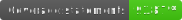

# xd-crossword-parser
A library for converting .xd crossword data (as defined by Saul Pwanson - http://xd.saul.pw) to JSON by Jason Norwood-Young

   

## Installing

```
npm install --save xd-crossword-parser
```

## Usage (Babel, Node.js etc)

```
const xdparser = require("xd-crossword-parser");
let crosswordData = xdparser(data);
```

## Usage (TypeScript)

```
import XDParser from "xd-crossword-parser";

const parsed = XDParser(source);
// parsed has type XDParsed { meta, grid, across, down, raw* strings }
```

## Minimal .xd example

The parser expects 4 sections separated by a blank line: meta, grid, across clues, down clues.

```
Title: Example Crossword
Author: You
Editor: Someone
Date: 2025-01-01

AB#C
DE#F

A1. One ~ ONE
A2. Two ~ TWO

D1. Down ~ DOWN
D2. Two ~ TWO
```

Result shape (simplified):

```
{
  meta: { Title, Author, Editor, Date },
  grid: [["A","B","#","C"],["D","E","#","F"]],
  across: [{ num: "A1", question: "One", answer: "ONE" }, ...],
  down:   [{ num: "D1", question: "Down", answer: "DOWN" }, ...]
}
```

## Notes and gotchas

- Line endings: CRLF (Windows) and LF are both supported; CRLF will be normalized internally.
- Blank lines inside the clues are ignored.
- Clue format must be: `<ID>. <Question> ~ <ANSWER>` (e.g. `A1. One ~ ONE`). If a clue line does not match, the parser throws with a helpful message.
- The 4 sections are separated by single blank lines. A different number of sections will throw (e.g. "Wrong number of parts").

## Testing

```bash
npm i
npm run test
# Generate coverage report
npm run test:coverage
# Generate Github badges
npm run test:badges
```